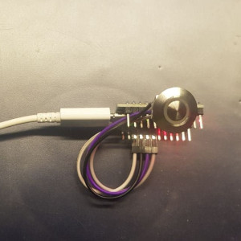
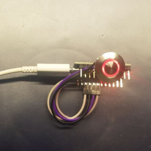

# Big Red Button for "Big Blue Button"

The uprising amount of video conferences in 2020 due to the ongoing COVID-19 crisis
lead me to build a small microphone switch for easy mute / unmute operation. In 
video- or audioconferences, you should keep muted to reduce background noise for 
all the others.

There are two common usage patterns for a microphone during conferences:

1. You're the speaker and about to speak > 10 seconds.
   Manual toggle, switching your mic on and off again later.
2. You're making occasional comments or short statements.
   Push-to-talk like experience, unmuting when pushed and going right back to mute when done.

This project aims to support both use cases with a single button (tactile switch). As I laid 
my hands on a few buttons with red LED rings, I called this "big red button" for a very commonly used
video conferencing software in academia, [Big Blue Button](https://bigbluebutton.org/).

 

(This is still lacking a case. Early stage of development...)

## DISCLAIMER

THIS IS A WORK IN PROGRESS.

Feel free to rebuild, adapt, do-the-fuck-you-want. But don't hold me accountable for any damage
you are doing to yourself, your environment, your computer or whatever.

I know what I'm doing. If you don't, stop reading here and go away. This is not for you.
You have been warned. Soldering iron is hot at its head.

## How does this work

Actually it's pretty low-tech: a button, a LED if you want and a microcontroller with USB HID support.
The device will start with LED on (if present), as most certainly your mic is enabled during boot.

1. Use case 1: every time the button is "clicked" (pressed shortly), it will toggle the LED
   and send a key code.
2. Use case 2: when you press and hold the switch, it will toggle the LED, send a keycode on press and
   do the same on release.
3. A double click inverts the LED color, so you can align the status LED with your real mic status.
   There is no easy, portable way to set the mic status on the device, so let's do this little workaround.

How does this magic work? Easy: the keycode is like pressing **F20** on your keyboard. What, only up to F12
on yours? Guess what, there are historic [keyboards with more function keys (F13-F24)](https://www.win.tue.nl/~aeb/linux/kbd/scancodes-5.html)...
Rare these days, I guess.

*Future idea:*

*Add a triple-click to switch modes for different Windoze programs? We can emulate so many shortcut combos as we want...*

## Bill of materials

1. Get hold of a USB HID capable device like the [Arduino Micro](https://store.arduino.cc/arduino-micro).
   - Or anything else featuring e. g. an Atmega16u2 or Atmega32u4. A "Nano Every" might work, too.
     Or use a cheaper [Sparkfun Pro Micro](https://www.sparkfun.com/products/12640) or one of its
     even much cheaper clones. (I got mine from https://eckstein-shop.de)
   - Do not try to do bit-banging USB in 2020 with Attiny85 or Atmega328P.
     Good chances this will not work with todays USB controllers.

2. Get hold of a nice button.
   - It should be easy to press and hold for some time.
   - It will be more fancy with builtin light status indicator.
   - It should be short, so you have as little overall height as possible.
     While you can use big buttons with great haptic feedback, those are usually quite long.
   - You might go for silicone elastomer keypads.
   - I choose a vandalism-proof switch with an integrated LED ring light. No RGB to be found, but
     red seems fine. They aren't cheap, but they feel great and have the LED resistor already
     builtin. https://www.ebay.de/itm/373023977424
     
3. If you didn't go for fancy LED switches, you might add a LED plus 220 Ohm resistor yourself. Up to you.
4. More fancy? Add a speaker, create a beep. No way I would do that, but you could...

## Usage hints

### Linux
Should work out of the box, as F20 is a default for microphone mute under Ubuntu, Fedora, ...

### Windows
No global hotkey for managing your microphone available. Stuff like the Lenovo Laptop Keyboard microphone
button uses special quirks and drivers (I know from the Linux kernel). This is just screwed up, but you might try
[AutoHotKey](https://www.autohotkey.com), using their [SoundSet](https://www.autohotkey.com/docs/commands/SoundSet.htm)
function. [It might even work without admin priviliges.](http://www.thenickmay.com/articles/how-to-install-autohotkey-without-admin)

### Mac OS
I don't have one. Glad to accept a PR.
